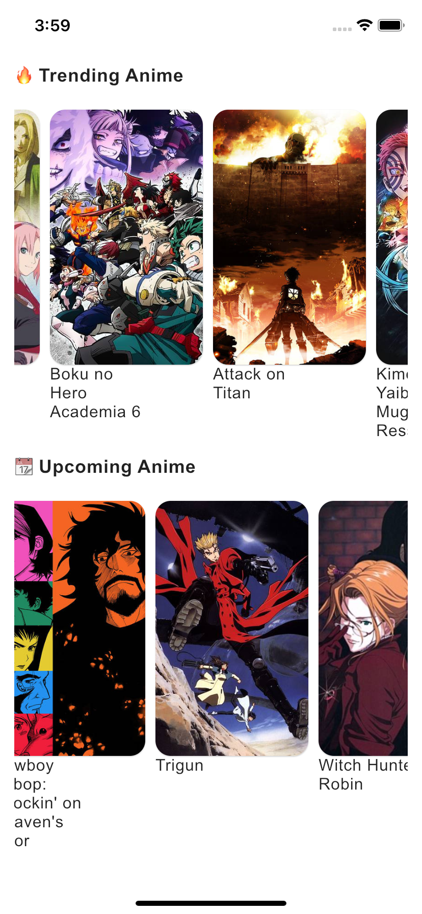
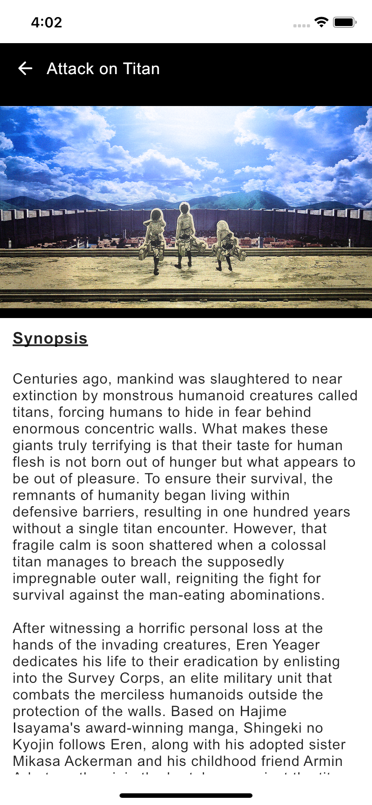
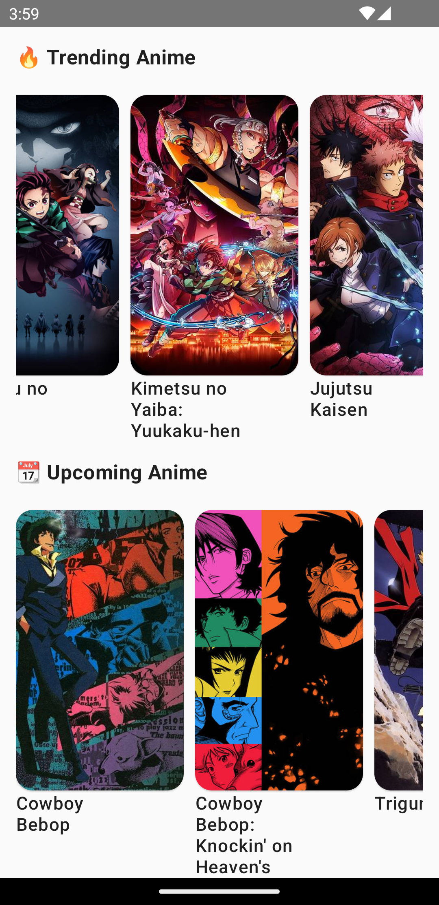

# AnimeFollowKMM 
An app that allows you to discover anime built with Kotlin Multiplatform Mobile which allows sharing of both UI and logic between the Android and IOS platforms 📱

## Demo
### iOS
 

#### Android
 

## Tech Stack.
- [Voyager](https://github.com/adrielcafe/voyager) - A multiplatform navigation library built for, and seamlessly integrated with, Jetpack Compose.
- [Koin](https://insert-koin.io/) - Koin is a lightweight and pragmatic dependency injection framework for Android development, allowing for easy management and injection of dependencies into Android applications.
- [Ktor](https://ktor.io/) - Ktor for Android is a lightweight and efficient framework that enables developers to build high-performance server-side applications and web services on the Android platform using Kotlin.
- [Kitsu API](https://kitsu.docs.apiary.io/#introduction) - Kitsu is a modern anime discovery platform that helps you track the anime you're watching, discover new anime and socialize with other fans.

## Benefits of KMM
- Code sharing: With KMM, you can write shared code that can be used across multiple platforms, such as Android and iOS.
- Single-language development: KMM enables you to use Kotlin as the primary programming language for both the shared code and platform-specific code.
- Consistent business logic: KMM allows you to implement and share business logic, network calls, data models, and other core functionalities across platforms.
- Faster time to market: By sharing code and leveraging KMM's cross-platform capabilities, developers can significantly reduce development time and effort.
- Reduced maintenance overhead
- Native platform integration: KMM allows seamless integration with platform-specific APIs, libraries, and UI components.

## Resourceful Projects 🌟
- [GoTCharactersKMM](https://github.com/JoelKanyi/GoTCharactersKMM.git) - by [Joel Kanyi](https://github.com/JoelKanyi)
- [Foodium-KMM](https://github.com/PatilShreyas/Foodium-KMM.git) - by [Shreyas Patil](https://github.com/PatilShreyas)
- [Compose Multiplatform iOS+Android Application project template](https://github.com/JetBrains/compose-multiplatform-ios-android-template)

## Goals
- [ ] Add ability to add to a favorite list
- [ ] Show characters of a particular anime
- [ ] Improve UI/UX
- [ ] Filter anime by categories
- [ ] Publish to PlayStore
- [ ] Publish to AppStore